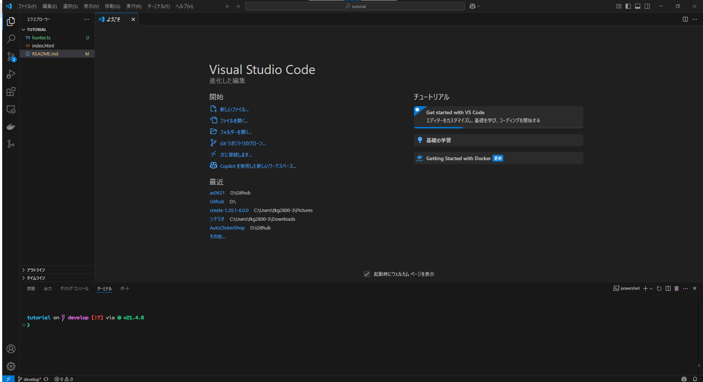
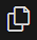
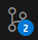
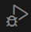
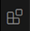
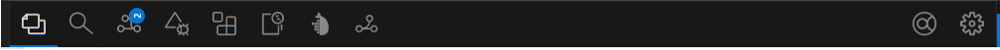

# 🚀 プログラム初心者のための開発環境ガイド

このREADMEでは、プログラム開発を始める皆さんがよく使うツールや概念について、基本的な使い方をまとめました。一つずつ理解して、開発の第一歩を踏み出しましょう！

-----

## 目次

1.  [VS Code (Visual Studio Code) の解説](https://www.google.com/search?q=%231-vs-code-visual-studio-code-%E3%81%AE%E8%A7%A3%E8%AA%AC)
2.  [Linuxコマンドの基本（ファイル・フォルダ操作）](https://www.google.com/search?q=%232-linux%E3%82%B3%E3%83%9E%E3%83%B3%E3%83%89%E3%81%AE%E5%9F%BA%E6%9C%AC%E3%83%95%E3%82%A1%E3%82%A4%E3%83%AB%E3%83%95%E3%82%A9%E3%83%AB%E3%83%80%E6%93%8D%E4%BD%9C)
3.  [Dockerの基本的な使い方（Dockerfileなし）](https://www.google.com/search?q=%233-docker%E3%81%AE%E5%9F%BA%E6%9C%AC%E7%9A%84%E3%81%AA%E4%BD%BF%E3%81%84%E6%96%B9dockerfile%E3%81%AA%E3%81%97)
4.  [GitHubの使い方](https://www.google.com/search?q=%234-github%E3%81%AE%E4%BD%BF%E3%81%84%E6%96%B9)
5.  [Git操作の基本用語まとめ](https://www.google.com/search?q=%235-git%E6%93%8D%E4%BD%9C%E3%81%AE%E5%9F%BA%E6%9C%AC%E7%94%A8%E8%AA%9E%E3%81%BE%E3%81%A8%E3%82%81)

-----

## 1\. VS Code (Visual Studio Code) の解説

VS Codeは、Microsoftが開発している**無料**の**オープンソース**の**高機能なコードエディタ**です。プログラムを書くためのメモ帳のようなものですが、色々な便利な機能がたくさん詰まっています。

### VS Codeの「すごい」ところ

  * **豊富な言語サポート**:
    JavaScript, Python, Java, C++, Go, PHP, Ruby, Rust, TypeScript, HTML, CSSなど、非常に多くのプログラミング言語に標準で対応しており、さらに拡張機能でサポートを強化できます。
  * **自動で補完してくれる (インテリセンス)**:
    強力なコード補完機能、構文ハイライト、コードの提案、定義へのジャンプなど、コードを効率的に書くための補助機能が充実しています。これにより、タイプミスを減らし、開発速度を向上させます。
  * **統合ターミナル**:
    エディタ内で直接コマンドライン（ターミナル）を開くことができます。これにより、ファイルを編集しながら、コンパイル、テストの実行、Gitコマンドの実行など、開発に必要なあらゆるコマンド操作をVS Codeから離れることなく行えます。
  * **Git統合**:
    Gitによるバージョン管理機能が標準で統合されています。ファイルの変更の追跡、コミット、ブランチの切り替え、マージ、差分の確認など、基本的なGit操作をVS CodeのUI上で直感的に行えます。
  * **デバッグ機能**:
    ほとんどのプログラミング言語に対応した強力なデバッグ機能が組み込まれています。ブレークポイントの設定、変数の監視、ステップ実行などにより、コードのバグを発見しやすくなります。
  * **拡張機能マーケットプレイス**:
    VS Codeの最大の魅力の一つが、豊富で活発な拡張機能のエコシステムです。テーマの変更、新しい言語サポート、追加のLinter（コード品質チェック）、フォーマッター、さらにはリモート開発やデータベース操作ツールなど、あらゆるニーズに対応する拡張機能が無料で提供されており、自分好みの開発環境を構築できます。
  * **マルチプラットフォーム対応**:
    Windows、macOS、Linuxの主要なOSで動作します。

### VS Codeの基本的な使い方と画面構成

ここでVS Codeの基本的な画面構成を、スクリーンショットを交えて解説しましょう。

-----



**解説**:

上記のスクリーンショットは、VS Codeの最も基本的な画面構成を示しています。

  * **エディタ領域**: 画面中央の広いエリアで、実際にコードを記述する場所です。複数のファイルをタブで開くことができます。
  * **サイドバー**: 画面左側に位置し、アイコンをクリックして様々な機能に切り替えられます。
      * ファイルエクスプローラー: 一番上のアイコンで、プロジェクトのフォルダやファイルの一覧が表示されます。ここからファイルを開いたり、新規作成、削除などの操作ができます。
      * 検索
      * ソース管理
      * デバッグ
      * 拡張機能
      * Docker container
      * git flow
  * **アクティビティバー**: サイドバーのさらに左端にあり、主要なビュー（ファイルエクスプローラー、検索、ソース管理、デバッグ、拡張機能など）を切り替えるためのアイコンが並んでいます。
  
  * **ステータスバー**: 画面の一番下にあり、現在開いているファイルの言語、行数、Gitのブランチ名、エラーや警告の数など、様々な情報が表示されます。
  
  * **統合ターミナル（通常は非表示）**: 画面下部に表示されることが多い、コマンドを実行するための黒い画面です。「ターミナル」メニューから「新しいターミナル」を選ぶと表示されます。

**基本的な操作の流れ**:

1.  **プロジェクトを開く**: VS Codeを起動したら、「ファイル」メニューから「フォルダーを開く」を選び、作業したいプロジェクトのフォルダーを選びます。これで、そのフォルダーの中のファイルがサイドバーに表示されます。
2.  **ファイルを編集する**: サイドバーのファイル一覧からファイルをクリックすると、エディタ領域で内容が表示されます。ここでプログラムを書いていきます。
3.  **保存する**: プログラムを書いたら、`Ctrl + S` (Macなら `Cmd + S`) で変更を保存しましょう。

-----

## 2\. Linuxコマンドの基本（ファイル・フォルダ操作）

プログラム開発では、LinuxというOSの「コマンド」（命令）を使って、ファイルやフォルダを操作することがよくあります。Windowsでマウスでファイルをドラッグ＆ドロップする代わりに、文字を入力して操作するイメージです。

### 基本概念

  * **フォルダ（ディレクトリ）**: ファイルを整理するための箱。Windowsのエクスプローラーの「フォルダ」と同じです。
  * **ファイル**: 実際のデータ（プログラムコード、文章、画像など）が保存されているもの。
  * **コマンド**: ターミナル（黒い画面）に入力する命令のことです。

### フォルダに関するコマンド

#### `pwd` (Print Working Directory) - 今いる場所を表示

  * **何をする？**: 今、あなたがファイルシステム上のどこで作業しているかを表示します。
  * **例**:
    ```bash
    pwd
    # 出力例: /home/your_user/documents
    ```

#### `ls` (List Directory Contents) - フォルダの中身を見る

  * **何をする？**: 今いるフォルダや指定したフォルダの中にどんなファイルやフォルダがあるか一覧表示します。
  * **よく使うオプション**:
      * `-l`: 詳細情報（作成日時、サイズなど）も表示。
      * `-a`: 隠しファイル（名前の前に`.`がつくファイル）も表示。
      * `-h`: ファイルサイズを「KB」や「MB」など、分かりやすい単位で表示（`-l`と一緒に使う）。
  * **例**:
    ```bash
    ls            # 今いるフォルダの中身
    ls -l         # 詳細情報も見る
    ls -la        # 隠しファイルも含めて詳細情報も見る
    ls /home/user # 特定のフォルダの中身を見る
    ```

#### `cd` (Change Directory) - フォルダを移動する

  * **何をする？**: 作業するフォルダを変更します。ファイルシステムの中を移動するイメージです。
  * **よく使う移動方法**:
      * `cd [フォルダ名]`: その名前のフォルダへ移動。
      * `cd ..`: 一つ上の階層のフォルダへ移動。
      * `cd ~`: 自分の「ホームフォルダ」（一番最初の場所）へ移動。
      * `cd /`: 一番上の階層（ルートディレクトリ）へ移動。
  * **例**:
    ```bash
    cd my_project     # 'my_project'フォルダへ移動
    cd ..             # 一つ上のフォルダへ戻る
    cd ~              # ホームフォルダへ移動
    ```

#### `mkdir` (Make Directory) - 新しいフォルダを作る

  * **何をする？**: 新しいフォルダを作成します。
  * **よく使うオプション**:
      * `-p`: 途中のフォルダがなければ、それも一緒に作ってくれます。
  * **例**:
    ```bash
    mkdir my_new_folder      # 'my_new_folder'というフォルダを作成
    mkdir -p project/src/data # 'project'フォルダの中に'src'、さらにその中に'data'を作成
    ```

#### `rmdir` (Remove Directory) - 空のディレクトリを削除

  * **何をする？**: 空のディレクトリを削除します。
  * **例**:
    ```bash
    rmdir empty_folder # 'empty_folder'が空の場合のみ削除
    ```

### ファイルに関するコマンド

#### `touch` - 空のファイルを作る

  * **何をする？**: 中身が何もない新しいファイルを作ったり、ファイルの更新日時を今に設定し直したりします。
  * **例**:
    ```bash
    touch empty_file.txt # 'empty_file.txt'という空のファイルを作成
    ```

#### `cat` - ファイルの中身を全部見る

  * \*\*何をする？?: ファイルの中身を画面に表示します。
  * **例**:
    ```bash
    cat my_document.txt # 'my_document.txt'の中身をすべて表示
    ```

#### `less` - ファイルの中身をページごとに見る

  * **何をする？**: 大きなファイルの内容を、画面に収まるように少しずつ表示します。
  * **使い方**: `less [ファイル名]` で起動。
      * `スペースキー`: 次のページへ。
      * `b`: 前のページへ。
      * `q`: 終了する。
  * **例**:
    ```bash
    less large_log.txt # 'large_log.txt'の内容をページごとに見る
    ```

#### `head` / `tail` - ファイルの先頭/末尾を見る

  * **何をする？**: `head`はファイルの先頭部分を、`tail`はファイルの末尾部分を表示します。ログファイルなど、最新の情報を確認したいときに便利です。
  * **よく使うオプション**:
      * `-n [数字]`: 表示する行数を指定。
      * `-f` (follow): `tail`専用。ファイルに追加される内容をリアルタイムで表示し続けます。（ログ監視に便利！）
  * **例**:
    ```bash
    head my_file.txt        # ファイルの最初の10行を表示
    tail -n 5 access.log    # 'access.log'の最後の5行を表示
    tail -f app.log         # 'app.log'に新しい行が追加されるたびに表示（ログ監視）
    ```

#### `cp` (Copy files and directories) - ファイルやフォルダをコピーする

  * **何をする？**: ファイルやフォルダを複製します。
  * **よく使うオプション**:
      * `-r`: フォルダをコピーする際に、その中身も全てコピーします。
  * **例**:
    ```bash
    cp my_photo.jpg my_photo_copy.jpg # 'my_photo.jpg'をコピーして'my_photo_copy.jpg'を作成
    cp -r my_project_folder backup/   # 'my_project_folder'を'backup'フォルダの中にコピー
    ```

#### `mv` (Move/Rename files and directories) - ファイルやフォルダを移動/名前変更する

  * **何をする？**: ファイルやフォルダの場所を移動したり、名前を変更したりします。
  * **例**:
    ```bash
    mv old_name.txt new_name.txt # 'old_name.txt'の名前を'new_name.txt'に変更
    mv document.pdf /home/user/archives/ # 'document.pdf'を'archives'フォルダに移動
    ```

#### `rm` (Remove files and directories) - ファイルやフォルダを削除する

  * **何をする？**: ファイルやフォルダを削除します。
  * **注意**: **一度削除すると元に戻せません！慎重に使いましょう。**
  * **よく使うオプション**:
      * `-r`: フォルダを削除する際に、その中身もすべて削除します。
      * `-f`: 強制的に削除します。削除確認のメッセージを表示しません。
  * **例**:
    ```bash
    rm unwanted_file.txt     # 'unwanted_file.txt'を削除
    rm -r old_project_folder # 'old_project_folder'フォルダとその中身を削除
    # !! 非常に危険なコマンドなので注意 !!
    # rm -rf /* のようなコマンドは、システム全体を削除してしまう可能性があります。
    # 絶対に試さないでください。
    ```

-----

## 3\. Dockerの基本的な使い方（Dockerfileなし）

Dockerは、プログラムを「箱」（**コンテナ**と呼びます）に入れて、どこでも同じように動かすための技術です。自分でDockerファイル（箱の作り方を書いた設計図）を作らない場合、**誰かが作った「すぐに使える箱」をダウンロードして実行する**、という形でDockerを使います。

### Dockerって何？（Dockerfileを作らない人向け）

  * 例えるなら、「**箱に入ったすぐに使えるアプリ**」です。
  * 必要なソフト（例：データベースやウェブサーバー）を自分のパソコンに直接インストールする代わりに、そのソフトがすでに完璧に設定された状態の「箱」をダウンロードしてきて、ポンと置いてすぐに使い始めることができます。
  * 自分のパソコンを汚さずに、色々なソフトを試したり、動かしたりできるのが大きなメリットです。

### Dockerを使うメリット

1.  **環境構築が超簡単**: 面倒なインストールや設定なしに、すぐに動かしたいソフトを起動できます。
2.  **パソコンが汚れない**: Dockerで作られた「箱」は、あなたのパソコンのシステムとは独立しているので、使わなくなったら箱を捨てるだけで綺麗になります。
3.  **「動かない！」がなくなる**: 「Aさんのパソコンでは動くのに、Bさんのパソコンでは動かない」という環境による問題がなくなります。箱の中身はどこでも同じだからです。

### Dockerを使うための基本的な流れ

1.  **Docker Desktopのインストール**:
    まずは、あなたのパソコンにDockerを動かすためのソフトウェア「Docker Desktop」をインストールします。（Windows、macOS用があります。）
2.  **「箱」（Dockerイメージ）を探す**:
    「Docker Hub」というウェブサイトで、使いたいソフトの「箱」（Dockerイメージ）を探します。これは、たくさんのソフトの箱が公開されている「図書館」のようなものです。

### Dockerを使うための基本的なコマンド

ターミナル（コマンドライン）で以下のコマンドを使います。

1.  **イメージをダウンロードする (`docker pull`)**:
    Docker Hubから使いたいソフトの「箱」（Dockerイメージ）をダウンロードします。

    ```bash
    docker pull [イメージ名]:[タグ]
    # 例: Nginxというウェブサーバーの最新版をダウンロード
    docker pull nginx:latest
    # 例: PostgreSQLというデータベースのバージョン13をダウンロード
    docker pull postgres:13
    ```

    \*`:[タグ]`はバージョンなどを指定します。指定しない場合は`latest`（最新版）がダウンロードされます。

2.  **コンテナを実行する (`docker run`)**:
    ダウンロードしたイメージを使って、実際にソフトを動かす「コンテナ」（箱から取り出したソフト）を作成し、実行します。

    ```bash
    docker run [オプション] [イメージ名]:[タグ]
    # 例: Nginxウェブサーバーを起動し、パソコンの8080ポートとコンテナの80ポートを繋げる
    docker run -p 8080:80 --name my-nginx -d nginx:latest
    # -p 8080:80: あなたのPCの8080番ポートへのアクセスを、コンテナの中の80番ポートに転送します。
    # --name my-nginx: このコンテナに「my-nginx」という名前を付けます。
    # -d: コンテナを裏側（バックグラウンド）で動かし続けます。
    ```

3.  **動いているコンテナを見る (`docker ps`)**:
    今、あなたのパソコンで動いているDockerコンテナの一覧を表示します。

    ```bash
    docker ps
    ```

4.  **コンテナを止める (`docker stop`)**:
    動いているコンテナを停止します。

    ```bash
    docker stop [コンテナIDまたはコンテナ名]
    # 例: 「my-nginx」という名前のコンテナを停止
    docker stop my-nginx
    ```

5.  **コンテナを捨てる (`docker rm`)**:
    停止したコンテナを削除します。

    ```bash
    docker rm [コンテナIDまたはコンテナ名]
    # 例: 「my-nginx」という名前のコンテナを削除
    docker rm my-nginx
    ```

6.  **ダウンロード済みのイメージを見る (`docker images`)**:
    あなたのパソコンにダウンロードされているDockerイメージの一覧を表示します。

    ```bash
    docker images
    ```

7.  **イメージを削除する (`docker rmi`)**:
    ダウンロードしたDockerイメージを削除します。

    ```bash
    docker rmi [イメージ名]:[タグ] または [イメージID]
    # 例: Nginxのイメージを削除
    docker rmi nginx:latest
    ```

### 具体的な使用例

例えば、ウェブサイトを作るためにNginxというウェブサーバーを試したい場合：

1.  `docker pull nginx:latest` （Nginxの箱をダウンロード）
2.  `docker run -p 8080:80 --name my-webserver -d nginx:latest` （Nginxを動かす箱を実行し、パソコンの8080番ポートで見れるようにする）
3.  Webブラウザで `http://localhost:8080` にアクセスすると、Nginxの画面が表示されます。
4.  使い終わったら `docker stop my-webserver` で止めて、`docker rm my-webserver` で箱を捨てられます。

-----

## 4\. GitHubの使い方

GitHubは、Gitというシステムを使って、プログラムのコードやファイルをインターネット上で管理・共有するためのウェブサービスです。チームで開発したり、自分のプログラムを公開したりするのにとても便利です。

### GitHubって何？

  * プログラムの**履歴書**と**共有スペース**のようなものです。
  * 自分が書いたコードの変更履歴を記録し、いつでも過去の状態に戻したり、他の人に見せたりできます。
  * 世界中の開発者が自分のコードを公開していて、そこから学んだり、貢献したりできます。

### GitHubの主な機能

1.  **リポジトリ (Repository)**:

      * コードや関連ファイルをまとめて保存する場所です。プロジェクトごとに一つリポジトリを作ります。
      * 例えるなら、プロジェクトごとの「フォルダ」のようなものです。

2.  **バージョン管理 (Git)**:

      * プログラムの変更履歴を細かく記録します。
      * いつ、誰が、何を、なぜ変更したのか、全て記録されているので、いつでも過去の状態に戻したり、変更の差分を見たりできます。

3.  **共同作業**:

      * 複数人で一つのプロジェクトを同時に開発できます。
      * 他の人の変更と自分の変更を簡単に統合できます。

4.  **プルリクエスト (Pull Request / PR)**:

      * 自分の変更を、プロジェクトのメインのコードに取り込んでもらうための「お願い」です。
      * 他の人に見てもらい（レビュー）、問題がないか確認してもらうことができます。

### GitHubの基本的な使い方

1.  **GitHubアカウントの作成**:
    GitHubのウェブサイトでアカウントを登録します。

2.  **新しいリポジトリを作る**:
    GitHubのサイト上で「New repository」ボタンをクリックして、新しいプロジェクトのリポジトリ（保存場所）を作成します。

      * 名前をつけたり、説明を書いたりします。
      * 「Public」（公開）か「Private」（非公開）を選べます。

3.  **ローカルにコードを準備する**:
    自分のパソコン（ローカル）で、プログラムのファイルを作成したり編集したりします。

4.  **Gitで変更を記録する**:

      * まず、ターミナルでそのプロジェクトのフォルダに移動します。
      * `git init`: そのフォルダをGitで管理できるように初期設定します（最初の一回だけ）。
      * `git add .`: 変更したファイルをGitの「ステージ」（次回の変更に含める場所）に追加します。
      * `git commit -m "変更内容のメッセージ"`: ステージに追加した変更を「コミット」（確定・記録）します。この時、どんな変更をしたのか短いメッセージを必ず書きます。

5.  **GitHubにアップロードする (`git push`)**:
    ローカルでコミットした変更を、GitHub上のリポジトリにアップロードします。

    ```bash
    git remote add origin [GitHubリポジトリのURL] # 最初の一回だけ
    git push -u origin main # または master (ブランチ名によって変わる)
    ```

    \*2回目以降は、`git push` だけでOKです。

6.  **GitHubから最新のコードをダウンロードする (`git pull`)**:
    他の人がGitHubにアップロードした最新のコードを、自分のパソコンにダウンロードして同期します。

    ```bash
    git pull
    ```

### GitHubでよく使う用語

  * **リポジトリ (Repository)**: プロジェクトの全ファイルと履歴が保存されている場所。
  * **クローン (Clone)**: GitHub上のリポジトリを、自分のパソコンに丸ごとコピーすること。
  * **コミット (Commit)**: ファイルの変更履歴を確定・記録する操作。
  * **プッシュ (Push)**: ローカル（自分のパソコン）での変更を、GitHub（インターネット上）にアップロードする操作。
  * **プル (Pull)**: GitHub上の最新の変更を、ローカルにダウンロードする操作。
  * **ブランチ (Branch)**: コードの「枝分かれ」のこと。新しい機能の開発やバグ修正を、メインのコードに影響を与えずに行うために使います。
      * `master` / `main`: プロジェクトのメインとなる安定したコードのブランチ。
      * `develop`: 開発中の最新コードが集まるブランチ。
      * `feature`: 新しい機能を作るためのブランチ。
      * `hotfix`: 緊急のバグ修正のためのブランチ。
      * `release`: リリース準備のためのブランチ。
  * **マージ (Merge)**: 枝分かれしたブランチの変更を、元のブランチや別のブランチに統合する操作。
  * **プルリクエスト (Pull Request / PR)**: GitHub上で、自分のブランチの変更をメインのブランチにマージしてほしいと依頼する機能。他の人からのレビューを受けられます。

## 5\. Git操作の基本用語まとめ

この記事でも触れたGitの操作用語を、より詳しくまとめます。

### Git-flow とは？

Git-flowは、Gitを使ったプロジェクト管理において、ブランチ（コードの枝分かれ）をどう使うか、そのルールや手順をまとめたものです。これに従うと、チーム開発での混乱が減り、効率的に作業を進められます。

### 主要なブランチの役割

  * **master** (または **main**):
      * **役割**: 製品としてリリースされる安定したコードが置かれるブランチです。
      * **イメージ**: 「完成品」や「本番環境」のコード。リリースごとに「タグ」が付けられます。
  * **develop**:
      * **役割**: 日々の開発作業のベースとなるブランチです。
      * **イメージ**: 「開発中の最新版」のコード。新しい機能はここから始まり、ここに統合されます。
  * **featureブランチ**:
      * **役割**: 新しい機能を追加するときに使うブランチです。
      * **イメージ**: 「新機能開発のための作業場」。`develop`から分岐し、作業が終わると`develop`に戻します。
  * **hotfixブランチ**:
      * **役割**: リリース済みの製品に重大なバグが見つかった時に、緊急で修正するために使うブランチです。
      * **イメージ**: 「緊急修理工場」。`master`から分岐し、修正が終わると`master`と`develop`の両方に反映させます。
  * **releaseブランチ**:
      * **役割**: 新しい製品のリリース準備のために使うブランチです。
      * **イメージ**: 「リリース前の最終調整室」。`develop`から分岐し、リリース準備が整うと`master`と`develop`に反映させます。

-----


**解説**:

上の図は、Qiita記事「Git-flowの解説」で示されているGit-flowの標準的なブランチモデルです。それぞれの色の線が異なるブランチを表しており、時間の経過とともにどのように分岐し、開発が進み、最終的に`master`に統合されていくかが視覚的に理解できます。

  * **develop（開発ブランチ）**: 主な開発作業が行われる中心のブランチです。
  * **feature（機能ブランチ）**: 新しい機能の開発のために`develop`から枝分かれし、完成すると`develop`に統合されます。
  * **release（リリースブランチ）**: リリース準備のために`develop`から枝分かれし、最終調整後に`master`と`develop`の両方に統合されます。
  * **master（本番ブランチ）**: リリースされた安定版のコードが置かれるブランチです。
  * **hotfix（緊急修正ブランチ）**: `master`から直接枝分かれし、緊急のバグ修正後に`master`と`develop`の両方に統合されます。

この図と上記の各ブランチの役割を照らし合わせると、より深く理解できるでしょう。

-----

### Gitの主な操作コマンドと用語

  * **clone (クローン)**:
      * **操作**: `git clone [リポジトリのURL]`
      * **意味**: GitHubなどのリモートにあるリポジトリ（プロジェクトのコード）を、自分のパソコンに丸ごとコピーして持ってくることです。
  * **init (イニット)**:
      * **操作**: `git init` (通常はプロジェクトのフォルダで実行)
      * **意味**: 既存のフォルダをGitでバージョン管理できるように初期設定することです。
  * **add (アド)**:
      * **操作**: `git add [ファイル名]` または `git add .`
      * **意味**: 変更したファイルを、次のコミットの対象として「ステージングエリア」に追加することです。
  * **commit (コミット)**:
      * **操作**: `git commit -m "変更内容の短いメッセージ"`
      * **意味**: ステージングエリアに追加した変更内容を、Gitの履歴に正式に記録することです。この時、どのような変更をしたのかを示すメッセージが非常に重要です。
  * **push (プッシュ)**:
      * **操作**: `git push [リモート名] [ブランチ名]` (例: `git push origin main`)
      * **意味**: 自分のパソコン（ローカル）で行ったコミットを、GitHubなどのリモートリポジトリにアップロードすることです。これにより、他の共同作業者と変更を共有できます。
  * **pull (プル)**:
      * **操作**: `git pull [リモート名] [ブランチ名]` (例: `git pull origin main`)
      * **意味**: GitHubなどのリモートリポジトリにある最新の変更を、自分のパソコン（ローカル）にダウンロードして取り込むことです。
      * **rebase (リベース)**: `git pull --rebase`のように使うことがあります。自分の変更をリモートの変更の上に「再配置」することで、履歴をきれいに保つ方法です。
  * **branch (ブランチ)**:
      * **操作**: `git branch [新しいブランチ名]` (作成), `git switch [ブランチ名]` (切り替え)
      * **意味**: コードの履歴を枝分かれさせることです。メインの開発ラインに影響を与えずに、新しい機能の開発や実験的な変更を行うことができます。
  * **merge (マージ)**:
      * **操作**: `git merge [マージしたいブランチ名]`
      * **意味**: 枝分かれしたブランチの変更内容を、別のブランチ（通常は`develop`や`main`）に統合することです。
  * **Pull Request (プルリクエスト / PR)**:
      * **操作**: GitHubのウェブサイト上で行います。
      * **意味**: 自分のブランチで行った変更を、プロジェクトのメインのブランチ（例: `develop`や`main`）に取り込んでもらうための「提案」や「お願い」です。他の開発者がコードをレビューし、問題がなければマージされます。
